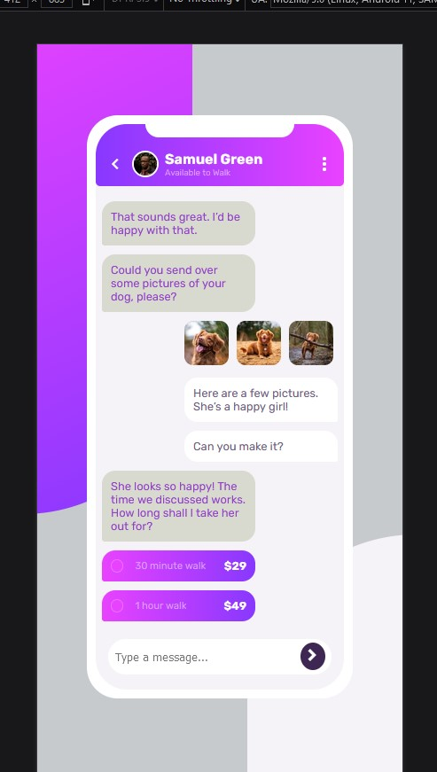

# Frontend Mentor - Chat app CSS illustration solution

This is a solution to the [Chat app CSS illustration challenge on Frontend Mentor](https://www.frontendmentor.io/challenges/chat-app-css-illustration-O5auMkFqY). Frontend Mentor challenges help you improve your coding skills by building realistic projects.

## Table of contents

- [Overview](#overview)
  - [The challenge](#the-challenge)
  - [Screenshot](#screenshot)
  - [Links](#links)
- [My process](#my-process)
  - [Built with](#built-with)
  - [What I learned](#what-i-learned)
  - [Continued development](#continued-development)
  - [Useful resources](#useful-resources)
- [Author](#author)
- [Acknowledgments](#acknowledgments)

## Overview

### The challenge

Users should be able to:

- View the optimal layout for the component depending on their device's screen size
- **Bonus**: See the chat interface animate on the initial load

### Screenshot

- Mobile View:-



- Laptop View:-


### Links

- Solution URL: [Github URL](https://github.com/issagoodlifeInc/Chat-App-Illustration.git)
- Live Site URL: [Chat App Illustratrion](https://chat-ilustration.netlify.app/)

## My process

### Built with

- Semantic HTML5 markup
- CSS custom properties
- Flexbox
- Mobile-first workflow

### What I learned

```css
/* Media query used to bring out the mobile layout */
@media only screen and (min-width: 960px) {
  main {
    max-width: 1000px;
    display: flex;
    justify-content: center;
    align-items: center;
    margin: 0 auto;
  }
}

/* Radio Input */

input[type="radio"] {
  appearance: none;
  background-color: var(--lightmagenta);
  border: 1px solid var(--vlightmagenta);
  font: inherit;
  width: 0.9rem;
  height: 0.9rem;
  border-radius: 50%;
}
```

### Continued development

### Useful resources

## Author

- Website - [Lesley Kimutai](https://leskimfamily.herokuapp.com/lesley)
- Frontend Mentor - [@leskim](https://www.frontendmentor.io/profile/leskim)

## Acknowledgments

-centering inputs -[stackoverflow](https://stackoverflow.com/questions/1281403/place-input-box-at-the-center-of-div)
